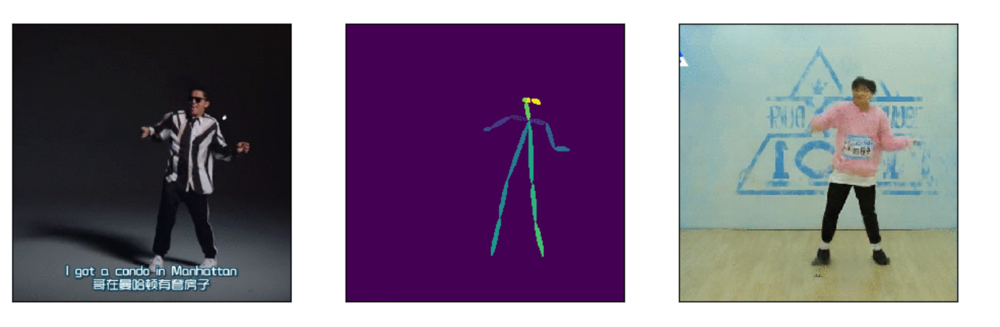
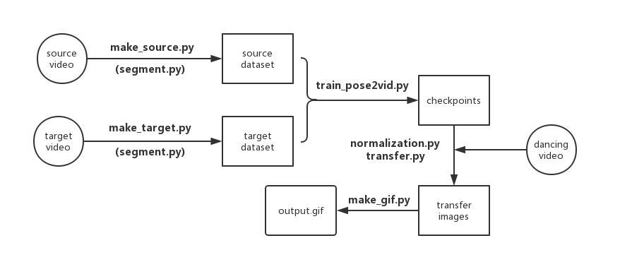
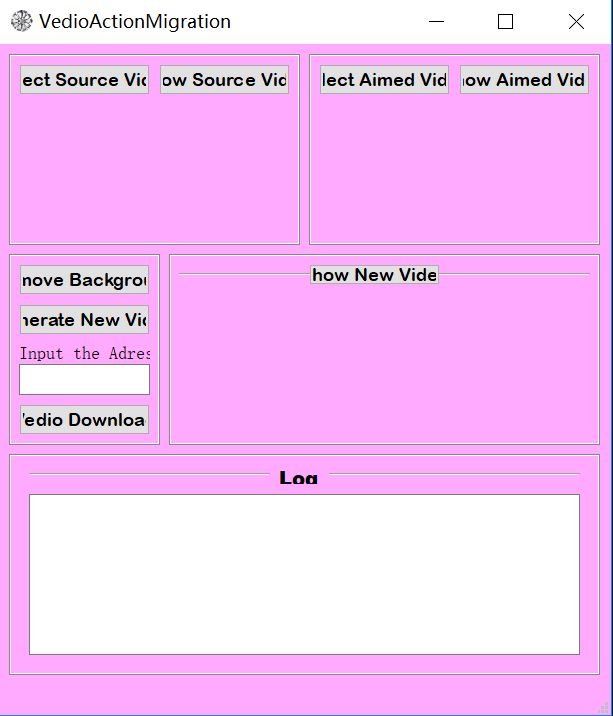
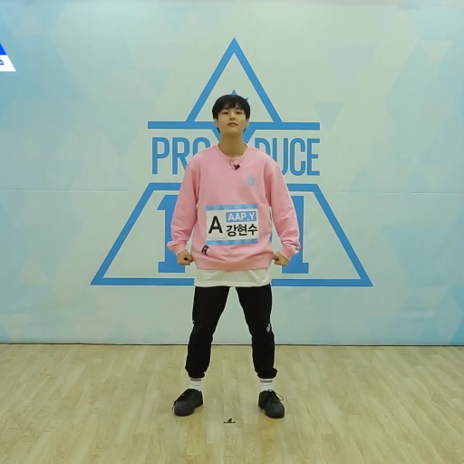
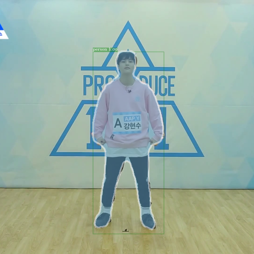
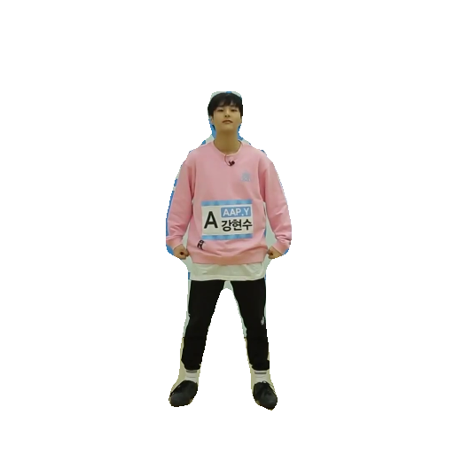
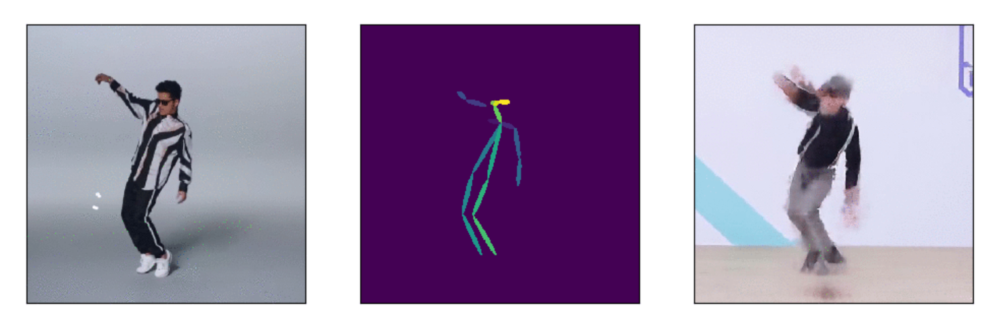
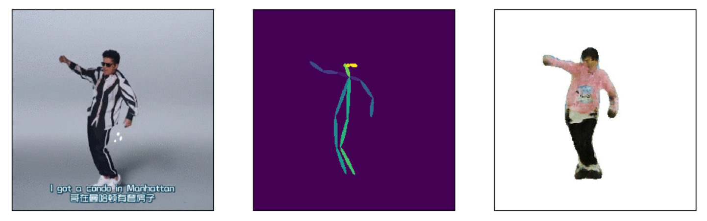
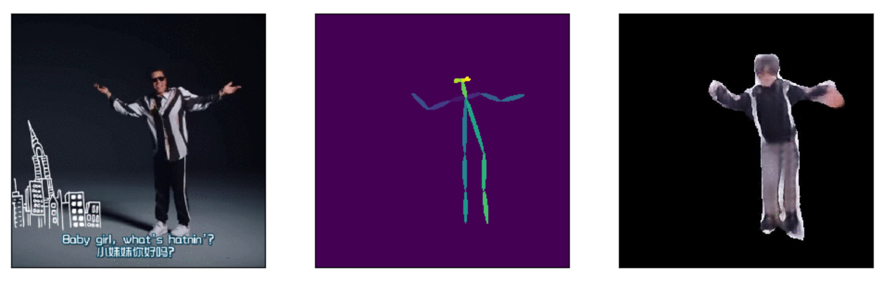

#                   Everybody dance now~ 

<p align="center">（Python与深度学习基础 第二次大作业）</p>
<div align="center"><b>关键词：动作迁移、pix2pixHD、OpenPose、mask R-cnn、OpenCV</b><br/><span style="white-space:pre">成员：陈文博、陈宇丰、崔冬琪、刘家宇、冯宇衡（组长）</span></div>

目录(按住ctrl点击链接以跳转)：

1  <a href="#1">功能描述与图像呈现</a>

​	1.1 <a href="#1.1"> 功能总述</a>

​	1.2  <a href="#1.2">图像呈现与数据分析</a>

2  <a href="#2">代码细节</a>

​	2.1  <a href="#2.1">文件</a>

​	2.2  <a href="#2.2">类</a>

​	2.3  <a href="#2.3">一些技巧（部分）</a>

3  <a href="#3">总结体会</a>

​	3.1  <a href="#3.1">总述</a>

​	3.2  <a href="#3.2">Bug与技巧</a>

​		3.2.1  <a href="#3.2.1">Spider相关</a>

​		3.2.2  <a href="#3.2.2">Database相关</a>

​		3.2.3  <a href="#3.2.3">Matplotlib相关</a>

​	3.3  <a href="#3.3">心得</a>


## 一、任务简介与背景介绍

该项目利用深度学习方法，实现视频内人物动作的迁移，只需有一个人约三分钟的视频，即可训练出属于该人的一个模型，对于任何合适的舞蹈视频均可实现动作迁移，你与舞王之差一张显卡的距离！

**背景介绍**

动作捕捉是好莱坞大片制作中常用到的一种技术，利用传感器获取演员的动作、表情等特征，在利用后期CG特效合成，可以制作出栩栩如生的虚构角色（例如猩球崛起、指环王等），我们小组企图利用深度学习方法，构建动作迁移算法，初步实现视频中人物的动作捕捉和动作合成。

## 二、数据处理

本项目的数据利用程序自动并获取标注，数据来自于视频，数据提取程序功能在于截取视频中有效图像以及利用OpenPose得到相应的姿态信息，预处理完的数据将保存在相应的文件夹下，等待下一步训练。

## 三、算法原理

#### （一）综述

利用OpenPose获取舞蹈者姿势骨架数据，利用pix2pixHD提供的GAN网络框架，实现舞蹈者——舞蹈——目标者——目标者舞蹈的效果



#### （二）使用的主要算法及其关系

#### 1、Pose Estimation

github地址：[https://github.com/tensorboy/pytorch_Realtime_Multi-Person_Pose_Estimation](https://github.com/tensorboy/pytorch_Realtime_Multi-Person_Pose_Estimation)

该算法实现人体姿势估计和骨架提取

#### 2、pix2pixHD

github地址：[https://github.com/NVIDIA/pix2pixHD](https://github.com/NVIDIA/pix2pixHD)

生成对抗网络框架，实现由姿态到对象的映射。

#### 3、detectron

github地址：[https://github.com/facebookresearch/Detectron](https://github.com/facebookresearch/Detectron)

目标识别分割框架平台，以实现人和背景的分离。


####　我们整合后的框架图：


#### （三）其他可能的算法

##### 1、语义分割

* FCN
* SegNet
* U-Net
* DeepLab
* RefineNet
* PSPNet

##### 2、图像生成

* pix2pix
* cycleGAN

#### （四）现用模型的优越性

##### 1、OpenPose

准确率高，修改方便。

##### 2、Mask-RCNN

边缘提取准确，精度高，速度快，修改方便。

##### 3、pix2pixHD

效果好，支持数量不相同的两份训练数据，在分辨率与图像质量上比其他方法好一些。

## 三、脚本与算法包及其功能

项目文件主要由主目录下7个程序脚本以及`./src`下的config和4个算法包组成，各脚本算法包功能如下：

### （一）脚本

#### 1、 make_source.py

从源视频（舞蹈）中截取图像数据并进行姿态估计和骨架提取，数据保存在`./data`。

#### 2、 make_target.py

从目标视频（表演者）中截取图像数据并进行姿态估计和骨架提取，数据保存在`./data`。

#### 3、segment.py

用于去除图像中人以外背景的脚本，可在**make_source.py**或**make_target.py**之后使用，将在data中生成相应的文件夹，只需替换数据集即可进行训练和转换。

#### 4、train_pose2vid.py

利用由**make_source.py**和**make_target.py**训练pix2pixHD提供的网络框架，将模型保存在`./checkpoints`文件夹下。

#### 5、normalization.py

全局姿态归一化。

#### 6、 transfer.py

由训练好的网络模型和源视频数据生成对应的图像保存在`./results`文件夹下。

#### 7、make_gif.py

将**transfer.py**操作之后的图片一帧一帧连起来生成gif文件，保存在`./output`文件夹下。

#### 我们整合后的流程图：



## 四、使用方法

### （一）无GUI版

* 新建文件夹./data，在./data内新建文件夹./data/source和./data/target，将源视频和目标视频分别放在./data/source/name和./data/target/name文件夹内，name为源视频或目标视频的文件名（不带扩展名）
* 分别运行make_source.py和make_target.py
* 选择性的运行segment.py，命令行参数为需要分割图片集所在的文件夹路径
* 运行train_pose2vid.py，开始训练网络，时间较长，请耐心等待
* 运行normalization.py，进行归一化
* 运行transfer.py
* 运行make_gif.py，之后即可在./output找到最后实现的gif文件


### （二）GUI界面上的使用



1、输入网址点击下载视频（you-get获取）

2、选择所要处理的源视频和目标视频

3、进行源视频和目标视频的数据采集

4、选择性的选择背景去除

5、进行训练与转换生成output.gif

## 五、基础工作与调试（PC上）

### （一）调研

#### 1、参考文献

[Everybody Dance Now](https://arxiv.org/pdf/1808.07371.pdf)

[RealtimeMulti-Person2DPoseEstimationusingPartAffinityFields](https://arxiv.org/pdf/1611.08050.pdf)

[pix2pixHD: High-Resolution Image Synthesis and Semantic Manipulation with Conditional GANs](https://www.paperweekly.site/papers/1278)

[MaskR-CNN](https://arxiv.org/pdf/1703.06870.pdf)

#### 2、参考开源项目

<https://github.com/nyoki-mtl/pytorch-EverybodyDanceNow>

<https://github.com/llSourcell/Everybody_Dance_Now>

<https://github.com/CUHKSZ-TQL/EverybodyDanceNow_reproduce_pytorch>

https://github.com/tensorboy/pytorch_Realtime_Multi-Person_Pose_Estimation

https://github.com/NVIDIA/pix2pixHD

<https://github.com/matterport/Mask_RCNN>

<https://github.com/shekkizh/FCN.tensorflow>

<https://github.com/shelhamer/fcn.berkeleyvision.org>

<https://github.com/alexgkendall/SegNet-Tutorial>

https://github.com/facebookresearch/Detectron

### （二）运行Demo

demo没有想象中的好跑，会遇到很多环境配置、GPU配置和库的问题，基本上有如下：

#### 1、opencv报错

由于电脑上装有ROS，而ROS自带有opencv，故在运行时会出现报错，解决方法：

在导入cv2之前加入这一句即可

```python
import sys
sys.path.remove('/opt/ros/kinetic/lib/python2.7/dist-packages')
```

#### 2、scipy.misc报错

demo中用到了scipy.misc.imread等一系列图像IO都出现报错，StackOverflow等网站都说需要安装pillow，然而pillow已经正常安装而且可以正常导入，最后并没有解决这个问题，而是用imageio库代替其读写图像的操作。

#### 3、一些中途故障（比如目标识别识别不到目标导致后续操作无法继续等）引起的程序中断

将易错代码段用try except异常处理进行完善，通过返回值等提高程序的鲁棒性。

#### 4、 怎么跑都跑不动

遇到过编译一直出错的demo，错误很长很迷，于是果断放弃，寻找其他同样模型的demo

### （三）demo优化以实现目标需要

#### 1、 文件结构

由于demo多数为了效果展示，而我们的项目更多为了批量制作，因此我们重新优化了一遍它的文件路径结构，主要是数据生成读取保存的路径，以适应项目需求。

#### 2、采集图像的优化

由于我们自己找的视频不如demo自带的视频那样标准（清晰、背景单一等等），有时候会出现一些问题（水印、人越出屏幕、人体不完整等等），或使数据生成程序中途崩溃，或影响最后模型训练效果，我们找到程序容易崩溃源，打包成函数，通过异常判断来决定返回值，当无异常时正常采图，出现异常时则跳过该图，提高程序的鲁棒性。

#### 3、增加数据来源途径

利用you-get脚本，实现一键爬取B站上的视频

#### 4、图像预处理的一些尝试

##### （1） 人脸判据

为保证训练数据中均有人的存在，我们考虑过使用人脸检测来判断人的存在，但最后没有采用。

##### （2）人体结构完整性判据

我们试图找到有模型可以刻画图像中人体结构的完整性（整个人都出现在图像中），例如四肢检测之类，发现并没有可以方便使用的框架，故不采用

##### （3）背景剔除

我们发现在带背景训练后，生成图像的背景往往不够稳定，容易和人混成一片，我们就想能否通过分离背景来提高实验效果，思路是利用语义分割框架提取人的边缘然后将背景替换成单一颜色。我们尝试如下框架：

* FCN全卷积网络
* segnet网络
* mask-rcnn网络

最后经过实验决定采用效果良好且操作简单的mask-rcnn来实现我们的目标

我们仔细阅读facebook发布的detectron中的demo，找到经过网络得到轮廓的代码段，通过约束识别目标类别和利用opencv进行图像加减处理，得到剔除背景的图像，达到我们的目的。

实现效果：

<figure class="Img">
    
    
    
</figure>
### （四）阶段性评估

#### 1、概述

从大致上看该算法基本能够实现肉眼可辨的动作迁移，但细节上还不够精细，一个是背景的干扰，一个是用于训练的目标视频中的人动作不够丰富也会对迁移的效果产生很大影响（比如近景、远景、转身等），mask-rcnn的分割效果很好，当时出现遮挡时也会出现目标掩模断裂的情况，对训练也不利。

#### 2、关于有无背景

针对背景干扰问题我们企图使用背景分离来优化，但是实验结果表明分离背景依旧有其很大局限性，由于该算法是通过GAN直接由骨架预测图像，故背景和人物作为整体被生成，单色背景也不例外，利用单色背景生成的模型实现的效果往往出现人物结构不完整、断裂的情况而且肉眼上看没有带背景的混淆要“自然“，因此通过剔除背景的优化效果并不是特别理想。

#### 3、关于目标视频的选取

 （1）背景最好无复杂图案，颜色单一

 （2）人的动作尽可能多样化：长景、近景、转身等

 （3）视频尽可能清晰

## 六、云平台上的工作

### （一）云平台环境配置

### （二）（云平台上）模型优化与效果比较


## 七、部分实现效果（gif太大，此处放截图）

### （一）带背景





### （二）不带背景






## 八、GUI的制作与使用

##### 1. 功能描述

GUI中显示五个小窗口：

1. 完成选择源视频及显示
2. 选择目标视频及显示
3. 选择去背景功能/生成新视频功能/输入视频相应网站地址下载功能
4. 显示合成的新视频
5. 实时日志显示程序进程

##### 2. 实验过程

1. 用tkinter搭建了基本的GUI框架，发现tkinter似乎不能显示视频，由于沟通问题以为不用显示最终效果视频，故采取截取源视频和目标视频第一帧的方法显示图片替代。
2. 用pyqt搭建GUI框架，由于怎么都配置不好pyqt5中的QMultimedia包，故采用先利用ffmpy将mp4格式文件先转换为gif格式，后用 PyQt5.QtGui中的QMovie和SetMovie方法显示。
3. 发现在耗时部分程序运行时GUI界面会卡死，故加入多线程。
4. 考虑到用户体验问题，加入从网站下载视频的功能。

#### GUI部分

##### 1. 效果展示

GUI界面展示如下：


运行中日志Log会实时显示运行情况：


## 九、总结与心得

### （一）main

* 由于程序运行数据量、计算量大，中途崩溃比较麻烦，故要设置很多断点判断和跳过异常的语句来提高效率，路径结构的复杂有时候也会导致手误覆盖了之前的数据集，比较麻烦。
* 最后效果在宏观动作上还可以，当在局部细节上还有很多提高空间，可能可以加上一些局部（脸、手等）增强的算法，使细节效果更好。
* 代码量不算特别大，但细节很多，程序运行时间也相对较长，不过当output.gif生成时，可以感受到那种文火慢炖炼得真丹得快感。

### （二）云平台的使用

* 移植过程遇到的问题:

  *  类脑环境的配置：

    由于类脑集群仅提供了基础镜像，需要自己手动安装运行所需包，在每次新建任务时都需要重复该步骤，我们有两种解决方案简化该步骤:

    (1)由于环境主要所缺少的主要是python包，并且由于国内conda源已经停运，故我们在配置中通过本地pip导出requirements.txt并上传，在每次任务开始时重新下载相应packages配置环境。

    (2)在本地直接打包所需要的python包并上传，在每次任务开始时解压至相应路径即可，此法可省去大量下载时间。

*  调试功能经常无法使用，缺少系统库

### （三）GUI部分

* 在这次大作业中学会了pyqt5库+QtDesigner的使用、you_get库的使用、文件操作方法、ffmpy库的使用、多线程原理及安排方法，收获颇丰；

* 此次大作业耗时最多的在于视频的显示及多线程处理的问题上，深切感受到了bug看似无解时转换思路的重要性。

